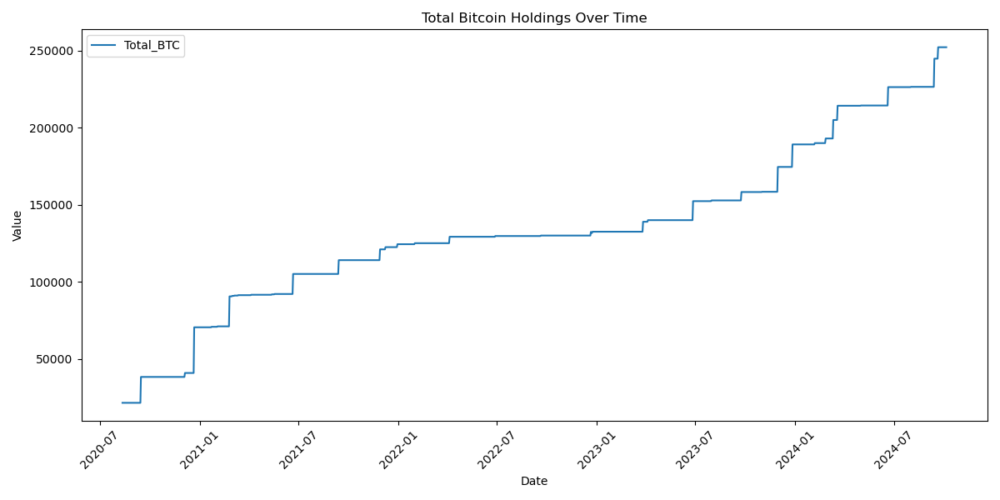
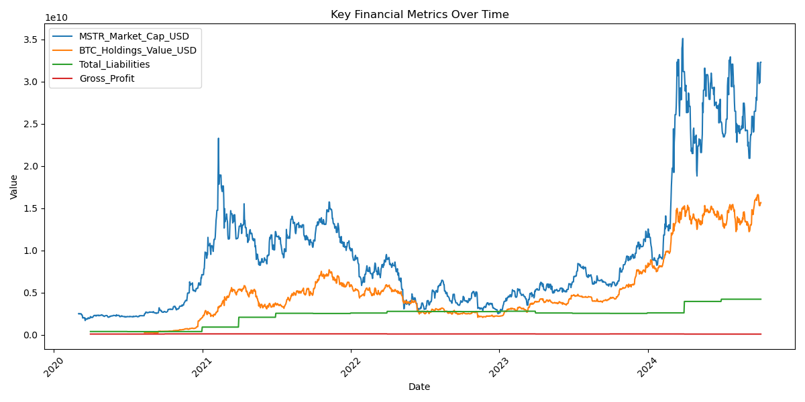
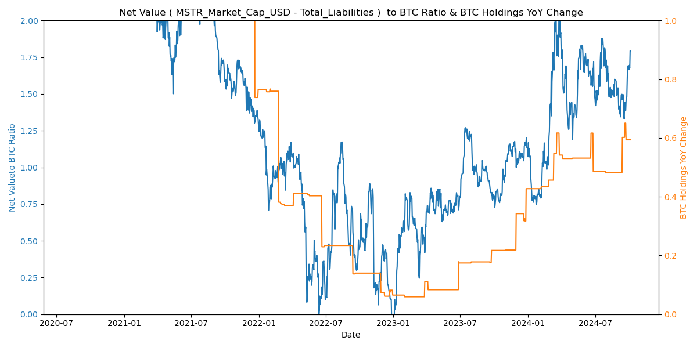
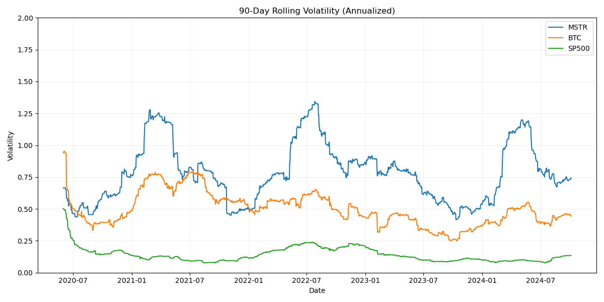

# ビットコインが変える企業戦略と投資の世界
## MicroStrategyの新たな取り組みから見る可能性

---

## はじめに：従来の常識を覆す企業戦略

- 2020年8月、MicroStrategyが画期的な決断
- 当初2億5000万ドルの手元資金をビットコインに投資
- 従来の企業財務戦略から100%の転換

---

## 1. MicroStrategyのビットコイン保有戦略

- 増資と転換社債発行してほぼ全額ビットコイン投資を繰り返してきた
- 2024年10月時点：252,220 BTCを保有（2兆円）

---

## 2. MicroStrategyの財務状況の変化

- 時価総額：5兆円
- ビットコイン保有額：2兆円
- 総負債：0.5兆円

---

## 3. ビットコイン保有と企業価値の関係

- ビットコイン保有額と時価総額に相関関係

---

## 4. MSTRプレミアムとビットコイン保有量増加率

- （時価総額-負債）/ビットコイン保有額比率：0-2.0で推移
- ビットコイン枚数の年平均成長率：50%

---

## 5. 投資パフォーマンス比較

- MSTR：2020年3月1日から2024年10月までで1000%成長
- ビットコイン：同期間で500%成長
- S&P 500：同期間で100%成長

---

## 6. 高リターンに伴う価格変動リスク

- MSTR：90日間ボラティリティ80%
- ビットコイン：90日間ボラティリティ40%
- S&P 500：90日間ボラティリティ20%

---

## 7. リスク調整後リターン：投資効率の分析

- 明確な序列は見られない

---

## 8. 市場感応度：ベータ係数の分析

- MSTR：ベータ値 0から6
- ビットコイン：ベータ値 0から2

---

## 9. 資産間の相関関係：BTC連動性

- MSTR とビットコイン：相関係数 0.5から0.8
- ビットコインとS&P 500：相関係数 0から0.5

---

## 10. 投資家への示唆：新たな投資アプローチ

- ビットコイン直接投資：高いリターン（年平均43%）とリスク（ボラティリティ75%）
- MSTR投資：さらに高いリターン（年平均58%）とリスク（ボラティリティ100%）
- ポートフォリオ配分：例えば、リスク許容度に応じて0-5%の配分を検討

---

## ご清聴ありがとうございました

ご質問やディスカッションをお待ちしております