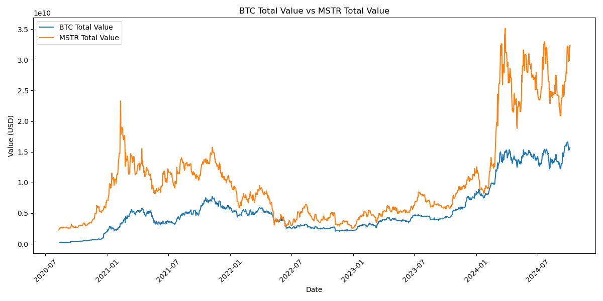

# 初心者のためのMicroStrategy株式とビットコイン投資の解説

## MicroStrategyって何？

MicroStrategyは、もともとはデータ分析の会社です。でも最近は、ちょっと変わったことをしています。なんと、会社のお金の大部分でビットコインを買っているのです！そう、あの仮想通貨のビットコインです。

## なぜこれが面白いの？

普通の会社は、自社の製品やサービスで儲けようとしますよね。でも、MicroStrategyは違います。この会社の株を買うことは、ある意味でビットコインを間接的に買うようなものなんです。面白いでしょう？

## 図を見てみよう

この図を見てください。青い線がMicroStrategyが持っているビットコインの価値、オレンジの線がMicroStrategy自体の価値（株式時価総額といいます）を表しています。

**何がわかる？**
1. 二つの線がほぼ一緒に動いています。つまり、ビットコインの価格が上がれば、MicroStrategyの株価も上がる傾向にあるということです。
2. 青い線（ビットコインの価値）が、ほとんどの場合オレンジの線（会社の価値）より上にあります。これは面白いポイントです。

## これは投資家にとって何を意味するの？

1. **二つの選択肢：** ビットコインに投資したい人には、直接ビットコインを買うか、MicroStrategyの株を買うか、二つの選択肢があるということです。

2. **潜在的なお買い得？：** 図を見ると、MicroStrategyの株式価値が持っているビットコインの価値より低いことが多いです。これは、MicroStrategyの株が「お買い得」かもしれないということを示唆しています。

3. **でも、ちょっと待って：** なぜ「お買い得」なのか考えてみましょう。会社の運営にはお金がかかります。借金もあるかもしれません。ビットコインを持つリスクもあります。これらが、株価がビットコインの価値より低い理由かもしれません。

## まとめ

1. MicroStrategyの株を買うことは、間接的にビットコインを買うようなものです。
2. でも、普通にビットコインを買うのとは少し違います。会社の運営や戦略なども株価に影響します。