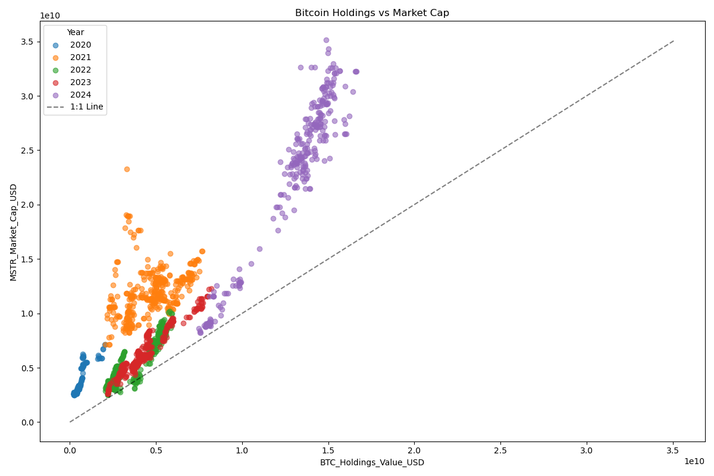
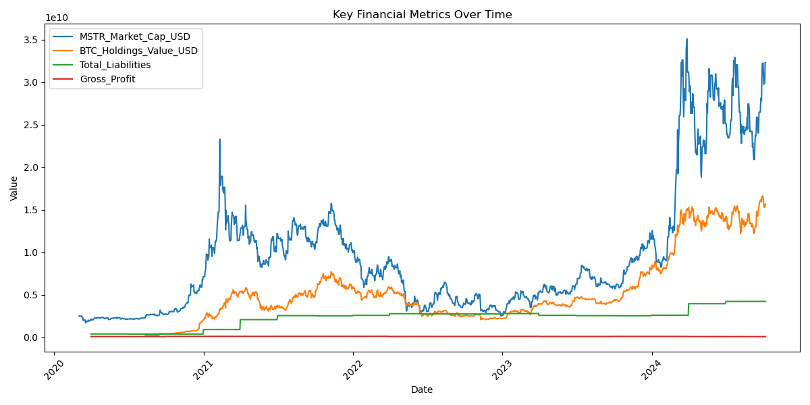
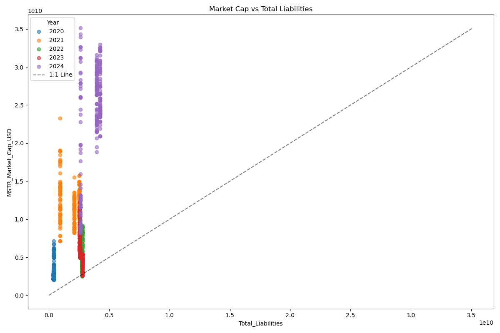
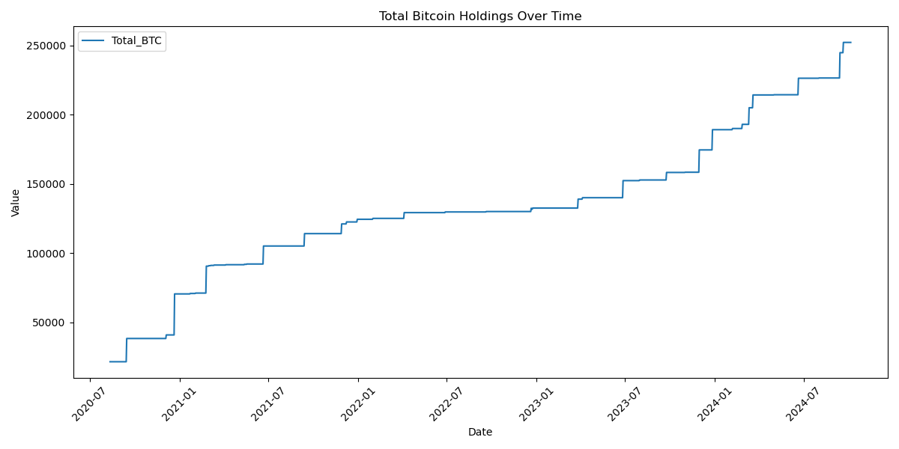
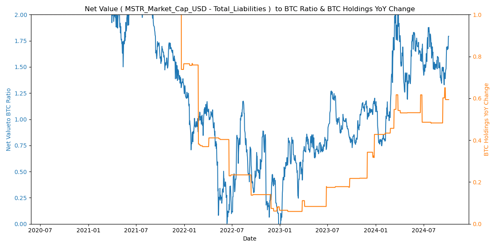
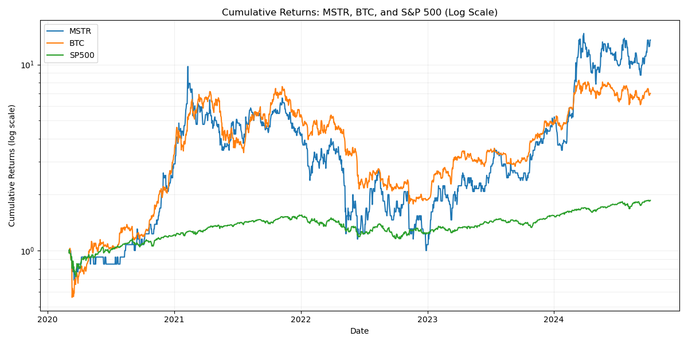
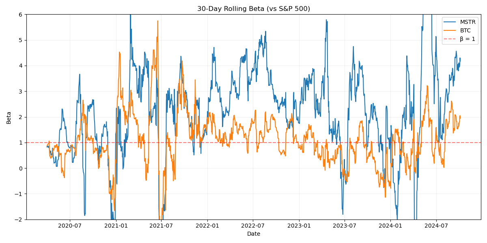
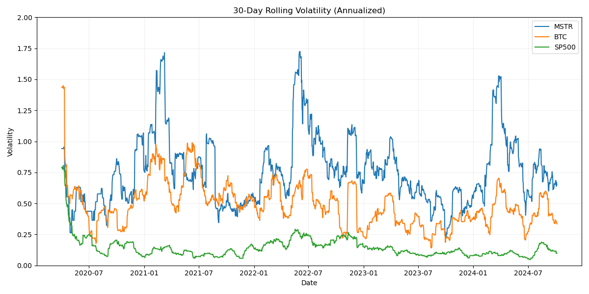
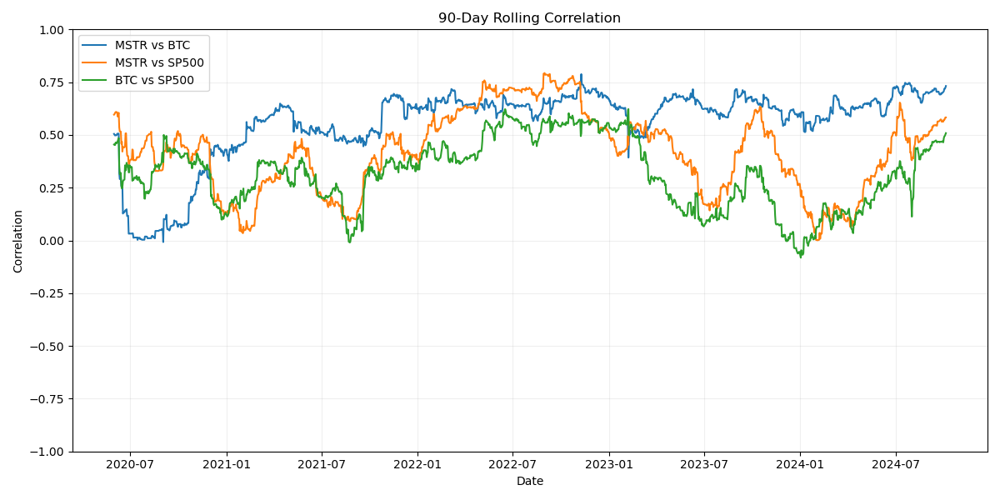
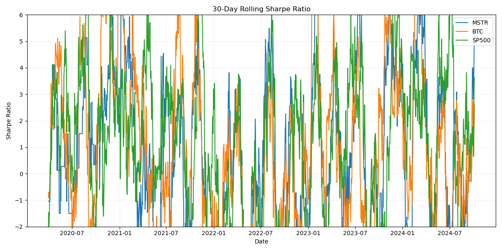

# MicroStrategy Bitcoin Analysis Tool

## 概要

このプロジェクトは、MicroStrategy社のビットコイン保有戦略を分析するためのツールセットです。株価データ、ビットコイン価格データ、および財務データを視覚化し、MicroStrategyの企業価値とビットコイン保有価値の関係を客観的に分析します。

## プロジェクト構成

- `data/`: 入力データファイルを格納
- `src/`: ソースコードファイルを格納
- `output/`: 生成されたデータとグラフを格納
  - `plots/`: 生成されたグラフ画像
  - `mstr_btc_metrics_daily.csv`: 日次の分析メトリクス
  - `mstr_btc_metrics_monthly_avg.csv`: 月次平均の分析メトリクス

主要なスクリプト：
1. `src/yf.py`: データ取得と前処理を行います。
2. `src/graph.py`: データの分析と視覚化を行います。

## MicroStrategyのビットコイン戦略：主要事実

1. **ビットコイン保有の推移**:
   - 初期購入: 2020年8月に開始
   - 継続的な増加: 2020年から2024年にかけて段階的に増加
   - 最新状況: 2024年時点で大幅に保有量を増加

2. **投資総額の推移**:
   - 初期投資額: 2020年時点で比較的小規模
   - 最新投資総額: 2024年時点で約15億ドル以上（グラフから推定）

3. **財務指標の変化**:
   - 市場資本金/ビットコイン保有価値比率:
     - 多くの期間で1以上を維持
     - 2024年に最も高い値を記録

4. **企業戦略の特徴**:
   - ビットコイン保有を主要な財務戦略として採用
   - 負債を活用したビットコイン購入戦略の実施
   - 市場資本金の変動がビットコイン保有価値の変動を上回る傾向

## データ分析と観察結果

### 1. ビットコイン保有価値 vs 市場資本金

#### 観察結果:
- 2020年から2024年にかけて、ビットコイン保有価値と市場資本金の増加傾向が見られます。
- 2021年に大きな上昇があり、その後2022年に下落、2023年から2024年にかけて再び上昇しています。
- 多くの期間で、市場資本金がビットコイン保有価値を上回っています（1:1ラインの上側）。
- 2024年には両指標とも大きく上昇し、過去最高値を更新しています。

### 2. 時系列分析：市場資本金、ビットコイン保有価値、総負債、粗利益

#### 観察結果:
- 市場資本金（MSTR_Market_Cap_USD）とビットコイン保有価値（BTC_Holdings_Value_USD）は類似した変動パターンを示していますが、市場資本金の方が変動が大きい傾向があります。
- 総負債（Total_Liabilities）は2021年から緩やかに増加し、2024年に入り急増しています。
- 粗利益（Gross_Profit）は他の指標と比較して変動が小さく、ほぼ横ばいです。
- 2021年初頭と2024年初頭に、市場資本金とビットコイン保有価値の大きな上昇が見られます。

### 3. 市場資本金 vs 総負債

#### 観察結果:
- 分析期間を通じて、市場資本金は総負債を大きく上回っています。
- 2024年には、総負債の増加と同時に市場資本金も大きく増加しています。
- 年を追うごとに、総負債と市場資本金の両方が増加傾向にあることが分かります。

### 4. Total Bitcoin Holdings Over Time

#### 観察結果:
- MicroStrategyのビットコイン保有量は2020年7月から急激に増加し始めています。
- 2021年1月頃に大きな増加が見られ、その後も段階的に増加を続けています。
- 2023年後半から2024年にかけて、保有量の増加ペースが加速しています。
- 2024年10月時点で、保有量は約250,000 BTCに達しています。

### 5. Net Value to BTC Ratio & BTC Holdings YoY Change

#### 観察結果:
- Net Value to BTC Ratioは2021年前半に最高値（約2.0）を記録した後、変動しながら低下傾向にあります。
- BTC Holdings YoY Changeは2022年初頭に急激な上昇を見せ、その後段階的に増加しています。
- 2023年後半から2024年にかけて、Net Value to BTC Ratioが再び上昇傾向を示しています。
- BTC Holdings YoY Changeは2024年に入って急激な上昇を見せており、積極的な購入戦略が継続していることが伺えます。

## 追加の統計分析

詳細な統計分析については、[stats.md](stats.md)を参照してください。このファイルには以下の分析が含まれています：

- 累積リターン（対数スケール）
- ローリングベータ（90日間）
- ローリングボラティリティ（90日間）
- ローリング相関（90日間）
- ローリングシャープレシオ（252日間）

これらの分析は、MicroStrategyの株価（MSTR）、ビットコイン（BTC）、S&P 500の比較を行っており、リスクとリターンの観点から詳細な洞察を提供しています。

### 1. 累積リターン (対数スケール)

- 対数スケールを使用することで、長期的な成長率の違いがより明確になりました。
- MSTR の累積リターンが最も高く、その成長率は BTC を上回っています。
- BTC も高い成長率を示していますが、MSTR ほどではありません。
- S&P 500 は最も安定した成長を示していますが、MSTR や BTC と比べると成長率は低くなっています。

### 2. ローリングベータ (90日間)

- MSTR と BTC のベータ値は大きく変動しており、多くの期間で1を超えています。これは両資産が S&P 500 よりもボラタイルであることを示しています。
- MSTR のベータは BTC よりも高い傾向にあり、より激しい価格変動を示しています。
- ベータが1を下回る期間もあり、これらの期間では MSTR や BTC が S&P 500 と逆の動きをする傾向があったことを示しています。

### 3. ローリングボラティリティ (90日間)

- MSTR のボラティリティが最も高く、急激な上昇を示す期間が複数あります。
- BTC も高いボラティリティを示していますが、MSTR ほどではありません。
- S&P 500 は最も安定しており、ボラティリティが低く抑えられています。
- MSTR と BTC のボラティリティは時期によって大きく変動しており、市場の不確実性や特定のイベントに敏感に反応していることがわかります。

### 4. ローリング相関 (90日間)

- MSTR と BTC の相関は概ね正の値を維持していますが、変動が大きいです。
- MSTR と S&P 500、BTC と S&P 500 の相関は時期によって大きく変動しており、-0.5から0.8の範囲で推移しています。
- 相関係数が負の値を取る期間があり、これらの期間では暗号資産市場と従来の株式市場が逆の動きをしていたことを示しています。

### 5. ローリングシャープレシオ (252日間)

- MSTR と BTC のシャープレシオは大きく変動しており、時期によってはマイナスの値を取ることもあります。
- S&P 500 のシャープレシオは比較的安定していますが、他の2資産と比べると低い値で推移しています。
- MSTR と BTC は高いリターンを示す期間もありますが、同時に高いリスクも伴っていることがわかります。

## ツールの使用方法

1. `src/yf.py` を実行してデータを取得・前処理します。
2. `src/graph.py` を実行してグラフを生成します。

生成されたグラフと処理済みデータは 'output/plots' ディレクトリに保存されます。

## 注意事項

- このツールは客観的なデータ分析を目的としており、投資助言を提供するものではありません。
- 暗号資産市場は高いボラティリティを示す傾向があり、過去のパフォーマンスが将来の結果を保証するものではありません。
- 分析結果の解釈や投資判断を行う際は、常に最新の市場動向と個別の状況を考慮する必要があります。