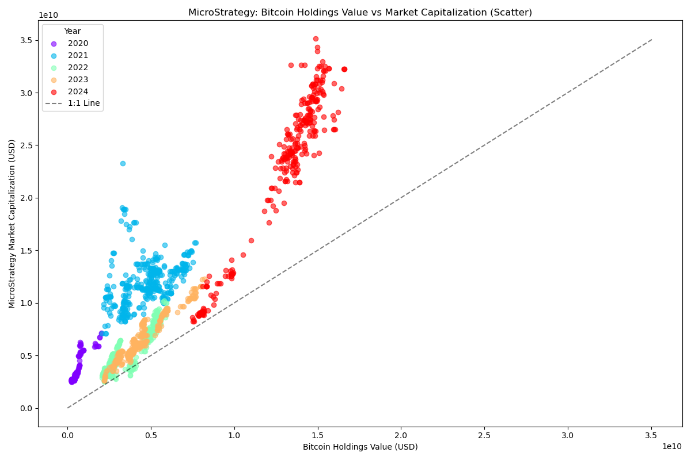
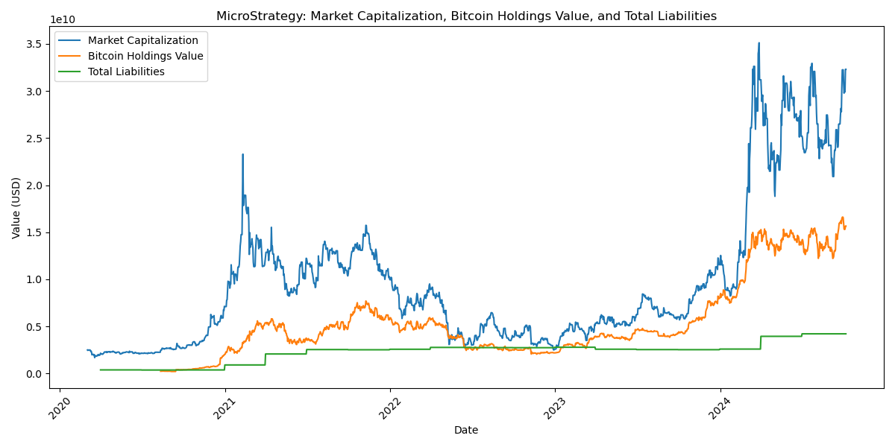
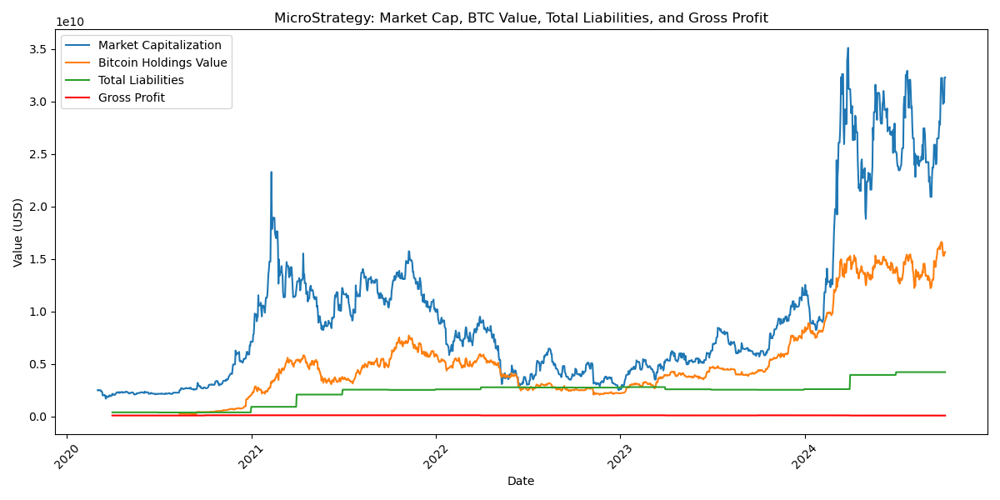
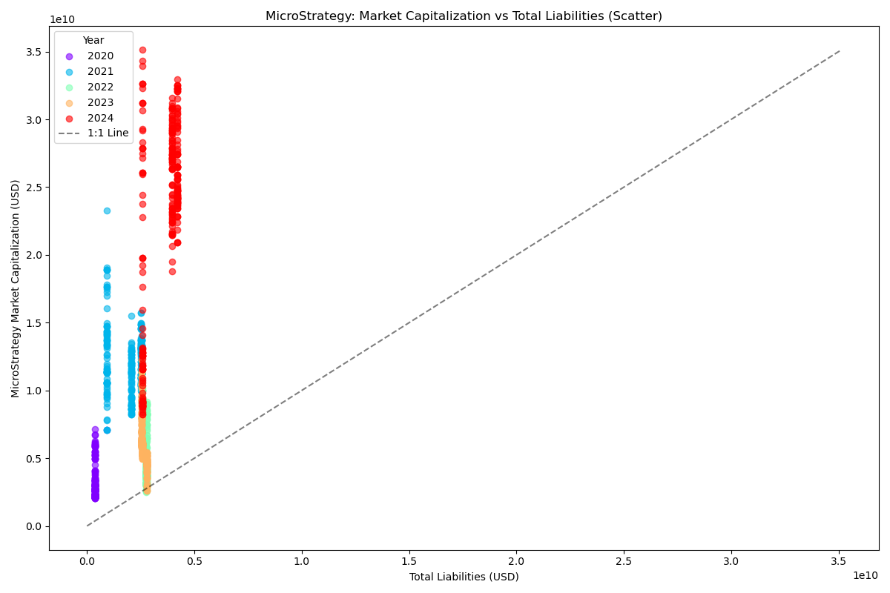

# MicroStrategy Bitcoin Analysis Tool

## 概要

このプロジェクトは、MicroStrategy社のビットコイン保有戦略を分析するためのツールセットです。株価データ、ビットコイン価格データ、および財務データを視覚化し、MicroStrategyの企業価値とビットコイン保有価値の関係を客観的に分析します。

## プロジェクト構成

- `data/`: 入力データファイルを格納
  - `btcholdings.csv`: MicroStrategyのビットコイン保有量データ
  - `mstr_financial_data.csv`: MicroStrategyの財務データ
- `src/`: ソースコードファイルを格納
- `output/`: 生成されたデータとグラフを格納
  - `plots/`: 生成されたグラフ画像
  - `mstr_btc_metrics_daily.csv`: 日次の分析メトリクス
  - `mstr_btc_metrics_monthly_avg.csv`: 月次平均の分析メトリクス

主要なスクリプト：
1. `src/yf.py`: データ取得と前処理を行います。
2. `src/graph.py`: データの分析と視覚化を行います。

## データ分析と観察結果

### 1. ビットコイン保有価値 vs 市場資本金

#### 観察結果:
- 2020年から2024年にかけて、ビットコイン保有価値と市場資本金の増加傾向が見られます。
- 2022年には一時的な下落が観察されましたが、その後回復しています。
- MicroStrategyの株価とビットコイン価格には強い相関関係が見られます。

#### 関連する市場事実:
- この期間、他の上場企業（例：Tesla、Block）もビットコインを貸借対照表に追加し始めました。
- 2022年の下落は、暗号資産市場全体の下落時期と一致しています。

### 2. 時系列分析：市場資本金、ビットコイン保有価値、総負債

#### 観察結果:
- 市場資本金とビットコイン保有価値は類似した変動パターンを示しています。
- 総負債は2024年に入り増加傾向が見られます。

#### 関連する市場事実:
- この期間、ビットコインETFの申請や大手決済企業による暗号資産サービスの導入など、暗号資産の主流化を示す動きがありました。

### 3. グロス利益を含む総合分析

#### 観察結果:
- グロス利益は他の指標と比較して変動が小さく、ほぼ横ばいです。
- 企業価値の変動は、主にビットコイン保有価値の変動と連動しています。

### 4. 市場資本金 vs 総負債

#### 観察結果:
- 分析期間を通じて、市場資本金は総負債を上回っています。
- 2024年には、総負債の増加と同時に市場資本金も増加しています。

## MicroStrategyのビットコイン戦略：主要事実

1. **ビットコイン保有の推移**:
   - 初期購入: 2020年8月11日に21,454 BTC
   - 大規模増加: 2020年12月21日に29,646 BTC追加
   - 最新状況: 2024年10月時点で252,220 BTC保有

2. **投資総額の推移**:
   - 初期投資額: 2億5,000万ドル
   - 最新投資総額: 99億1,000万ドル（2024年10月時点）

3. **財務指標の変化**:
   - BTC保有価値/MSTR時価総額比率:
     - 最小値: 約0.2（2020年初期）
     - 最大値: 約1.2（2022年中頃）
     - 平均値: おおよそ0.6-0.7の範囲

4. **企業戦略の特徴**:
   - ビットコイン保有を主要な財務戦略として採用
   - 負債を活用したビットコイン購入戦略の実施
   - コア事業（エンタープライズソフトウェア）と並行してビットコイン戦略を展開

## ツールの使用方法

1. `src/yf.py` を実行してデータを取得・前処理します。
2. `src/graph.py` を実行してグラフを生成します。

生成されたグラフと処理済みデータは 'output' ディレクトリに保存されます:

- `plots/bitcoin_holdings_vs_market_cap_scatter.png`: ビットコイン保有価値 vs 市場資本金の散布図
- `plots/market_cap_bitcoin_value_total_liabilities.png`: 市場資本金、ビットコイン保有価値、総負債の時系列プロット
- `plots/market_cap_bitcoin_value_total_liabilities_gross_profit.png`: 上記に加えてグロス利益を含む時系列プロット
- `plots/market_cap_vs_total_liabilities_scatter.png`: 市場資本金 vs 総負債の散布図
- `mstr_btc_metrics_daily.csv`: 日次の分析メトリクス
- `mstr_btc_metrics_monthly_avg.csv`: 月次平均の分析メトリクス

## 注意事項

- このツールは客観的なデータ分析を目的としており、投資助言を提供するものではありません。
- 暗号資産市場は高いボラティリティを示す傾向があり、過去のパフォーマンスが将来の結果を保証するものではありません。
- 分析結果の解釈や投資判断を行う際は、常に最新の市場動向と個別の状況を考慮する必要があります。
