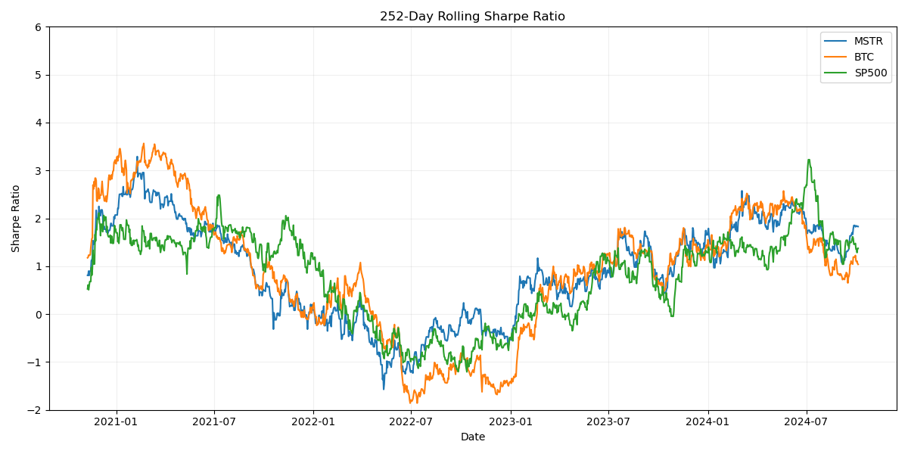

# MicroStrategy (MSTR)、Bitcoin (BTC)、S&P 500の統計分析

## 1. 累積リターン (対数スケール)

- 対数スケールを使用することで、長期的な成長率の違いがより明確になりました。
- MSTR の累積リターンが最も高く、その成長率は BTC を上回っています。
- BTC も高い成長率を示していますが、MSTR ほどではありません。
- S&P 500 は最も安定した成長を示していますが、MSTR や BTC と比べると成長率は低くなっています。

## 2. ローリングベータ (90日間)

- MSTR と BTC のベータ値は大きく変動しており、多くの期間で1を超えています。これは両資産が S&P 500 よりもボラタイルであることを示しています。
- MSTR のベータは BTC よりも高い傾向にあり、より激しい価格変動を示しています。
- ベータが1を下回る期間もあり、これらの期間では MSTR や BTC が S&P 500 と逆の動きをする傾向があったことを示しています。

## 3. ローリングボラティリティ (90日間)

- MSTR のボラティリティが最も高く、急激な上昇を示す期間が複数あります。
- BTC も高いボラティリティを示していますが、MSTR ほどではありません。
- S&P 500 は最も安定しており、ボラティリティが低く抑えられています。
- MSTR と BTC のボラティリティは時期によって大きく変動しており、市場の不確実性や特定のイベントに敏感に反応していることがわかります。

## 4. ローリング相関 (90日間)

- MSTR と BTC の相関は概ね正の値を維持していますが、変動が大きいです。
- MSTR と S&P 500、BTC と S&P 500 の相関は時期によって大きく変動しており、-0.5から0.8の範囲で推移しています。
- 相関係数が負の値を取る期間があり、これらの期間では暗号資産市場と従来の株式市場が逆の動きをしていたことを示しています。

## 5. ローリングシャープレシオ (90日間)

- MSTR と BTC のシャープレシオは大きく変動しており、時期によってはマイナスの値を取ることもあります。
- S&P 500 のシャープレシオは比較的安定していますが、他の2資産と比べると低い値で推移しています。
- MSTR と BTC は高いリターンを示す期間もありますが、同時に高いリスクも伴っていることがわかります。

## 結論

1. MicroStrategy (MSTR) の株価は Bitcoin (BTC) と強い関連性を持ち、S&P 500よりもはるかに高いボラティリティとリターンを示しています。

2. MSTR と BTC のベータ値は1を大きく上回る期間が多く、市場全体よりも敏感に価格が変動する傾向があります。

3. ボラティリティの観点からは、MSTR > BTC > S&P 500 の順にリスクが高いと言えます。

4. 相関係数の変動から、MSTR と BTC の関係性は比較的安定していますが、これらと S&P 500 との関係は時期によって大きく変化することがわかります。

5. シャープレシオの分析から、MSTR と BTC は高いリターンを得られる可能性がある一方で、そのリスクも非常に高いことが確認できます。

6. これらの指標は時間とともに大きく変動するため、投資家は常に市場の動向を注視し、適切なリスク管理を行う必要があります。

投資家はこれらの分析結果を参考にしつつ、自身のリスク許容度と投資目標に応じて慎重に判断を行う必要があります。また、暗号資産市場の規制環境や技術的進展など、定量的分析では捉えきれない要因も考慮することが重要です。